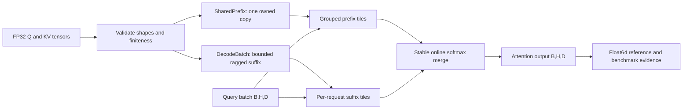

# Shared-Prefix Attention

Previously `prefixfold`. Package and command names remain unchanged (`prefixfold`).

**Exact shared-prefix decode attention on CPU.** A small numerical library that shares long KV prefixes across requests, groups their matrix multiplications, and merges tiled softmax states.

[GitHub](https://github.com/hardwork-xu/shared-prefix-attention) · [简体中文](README_zh.md) · [Research](docs/en/RESEARCH.md) · [API](docs/en/API.md) · [Experiments](docs/en/EXPERIMENTS.md)

[](https://github.com/hardwork-xu/shared-prefix-attention/actions/workflows/ci.yml)
[](LICENSE)
[](pyproject.toml)

I built PrefixFold to make one inference bottleneck inspectable: independent decode requests often share a long prompt, yet conventional contiguous KV batches store and read that prefix repeatedly. I want a project where ownership, numerical correctness and performance evidence can be understood together.

The intended users are engineers studying CPU attention, shared-context document workloads and numerical systems. This is an **attention operator**, with arbitrary finite FP32 tensor inputs and ragged suffixes. It is not a text-generation server or a complete model runtime.

## What this project contributes

- A real grouped prefix path using NumPy/BLAS, tiled stable softmax accumulation and a matching suffix path; `grouped=False` disables only cross-request prefix grouping.
- Owned immutable prefix tensors; fixed-capacity ragged suffixes; validated atomic append, synchronized reads and explicit cleanup.
- Configurable temporary-array planning, an independent float64 oracle, offline tests, a practical PyTorch CPU SDPA baseline, and raw source-linked benchmarks including regressions.

The decomposition and query grouping are established **Cascade Attention / Hydragen** ideas, not an original algorithm. NumPy supplies arrays and BLAS; this repository supplies ownership, execution partitioning, state accumulation and evaluation. See [attribution](NOTICE.md) and the [verified source register](research/sources.json). There is no SOTA claim.



For scores $x_j=q^T k_j/\sqrt D$, each partition tracks $m=\max x_j$, $l=\sum_j e^{x_j-m}$, $z=\sum_j e^{x_j-m}v_j$. Merging rescales both states to the larger maximum and adds their `l` and `z`; the output is `z/l`. No attention weights are approximated. FP32 rounding is checked against FP64 with `atol=rtol=3e-5`.

With batch `B`, heads `H`, shared length `P`, reserved suffix capacity `C`, and dimension `D`, K/V storage is `8 H D (P + B C)` bytes versus `8 B H D (P + C)` for duplicated FP32 caches. These are array payload formulas, **not process RSS**. Arithmetic remains proportional to all query–key interactions; grouping improves data reuse and BLAS utilization.

## Install and run

Python **3.11–3.13** is the declared range. The measured host is **macOS arm64, Python 3.12.2, M1 Pro, 16 GiB**. The implementation uses the CPU only; installed Metal/MPS availability does not imply a GPU backend. Linux CPU CI/container configuration is included; check [release status](docs/en/RELEASE.md) for actual validation.

From the repository root:

```sh
python3 -m venv .venv
.venv/bin/python -m pip install uv==0.8.22
.venv/bin/uv sync --frozen --group bench
make demo
.venv/bin/python examples/decode.py
make test check
make benchmark analyze
make build
```

The demo is offline and prints a numerical comparison, actual allocated payload and suffix lengths. No model download, key or private data is required. The runtime package needs only NumPy; development and benchmark dependencies are separate locked groups. For a runtime-only environment, use `.venv/bin/uv sync --frozen --no-dev`.

```python
import numpy as np
from prefixfold import SharedPrefix, DecodeBatch, attend

rng = np.random.default_rng(42)
prefix = SharedPrefix(
    rng.standard_normal((2, 1024, 32), dtype=np.float32),
    rng.standard_normal((2, 1024, 32), dtype=np.float32),
)
with DecodeBatch(prefix, batch_size=4, capacity=8) as batch:
    batch.append(
        rng.standard_normal((4, 2, 32), dtype=np.float32),
        rng.standard_normal((4, 2, 32), dtype=np.float32),
    )
    output = attend(rng.standard_normal((4, 2, 32), dtype=np.float32), batch)
    print(output.shape)  # (4, 2, 32)
```

For existing tensors, `prefixfold attend input.npz output.npz --tile-tokens 1024` runs the same engine. The [API guide](docs/en/API.md) defines keys, shapes, errors and ownership. Input/output files must differ; existing output is not overwritten.

## Benchmark results

**Measured operator results, synthetic FP32 tensors, CPU only.** NumPy 2.2.6 and PyTorch 2.8.0; one thread requested for both. Apple Accelerate thread enforcement cannot be introspected through `threadpoolctl`, which is a measurement limitation. Every case has 5 warmups and 30 recorded observations per variant, interleaved in seeded random order across isolated workers. Construction and materialization are reported separately; this is not model end-to-end latency.

| Primary metric, B=16 H=4 P=4096 S=128 D=64 | Target (frozen before timing) | Measured |
|---|---:|---:|
| Allocated K/V payload reduction vs contiguous dense | ≥80% | 90.91% (132 → 12 MiB) |
| Median compute speedup vs PyTorch CPU SDPA | ≥1.25× | 3.50× (7.160 → 2.044 ms) |
| Correctness against FP64 | atol=rtol=3e-5, every case | All 28 case/variant pairs passed |

These figures are generated from the raw run; the [frozen targets](research/targets.json) remain unchanged. The default is slower than SDPA on no-prefix, single-request and short-prefix workloads. Use the measured crossover, not a blanket speed claim.

<!-- BENCHMARK:START -->

| Workload | Variant | Median ms | SDPA / variant | KV MiB | KV reduction | Max abs error | n |
|---|---|---:|---:|---:|---:|---:|---:|
| no_prefix | numpy_dense | 0.2029 | 1.222× | 4.000 | 0.00% | 2.30e-07 | 30 |
| no_prefix | torch_sdpa | 0.2480 | 1.000× | 4.000 | 0.00% | 2.13e-07 | 30 |
| no_prefix | prefixfold | 0.4081 | 0.608× | 4.000 | 0.00% | 2.09e-07 | 30 |
| no_prefix | ungrouped | 0.4193 | 0.591× | 4.000 | 0.00% | 2.09e-07 | 30 |
| single_request | torch_sdpa | 0.5357 | 1.000× | 8.250 | 0.00% | 3.14e-08 | 30 |
| single_request | ungrouped | 0.8724 | 0.614× | 8.250 | 0.00% | 2.84e-08 | 30 |
| single_request | prefixfold | 0.8819 | 0.607× | 8.250 | 0.00% | 2.84e-08 | 30 |
| single_request | numpy_dense | 0.4663 | 1.149× | 8.250 | 0.00% | 2.54e-08 | 30 |
| short_prefix | torch_sdpa | 0.4766 | 1.000× | 8.000 | 0.00% | 2.77e-07 | 30 |
| short_prefix | prefixfold | 0.5631 | 0.846× | 4.250 | 46.88% | 1.82e-07 | 30 |
| short_prefix | ungrouped | 1.3192 | 0.361× | 4.250 | 46.88% | 1.64e-07 | 30 |
| short_prefix | numpy_dense | 0.4352 | 1.095× | 8.000 | 0.00% | 2.70e-07 | 30 |
| shared_b4_p4096 | ungrouped | 2.0978 | 0.903× | 9.000 | 72.73% | 3.52e-08 | 30 |
| shared_b4_p4096 | torch_sdpa | 1.8942 | 1.000× | 33.000 | 0.00% | 3.71e-08 | 30 |
| shared_b4_p4096 | prefixfold | 1.0748 | 1.762× | 9.000 | 72.73% | 6.77e-08 | 30 |
| shared_b4_p4096 | numpy_dense | 1.6612 | 1.140× | 33.000 | 0.00% | 2.84e-08 | 30 |
| shared_b16_p4096 | numpy_dense | 6.6804 | 1.072× | 132.000 | 0.00% | 4.14e-08 | 30 |
| shared_b16_p4096 | torch_sdpa | 7.1603 | 1.000× | 132.000 | 0.00% | 4.16e-08 | 30 |
| shared_b16_p4096 | ungrouped | 7.2138 | 0.993× | 12.000 | 90.91% | 3.79e-08 | 30 |
| shared_b16_p4096 | prefixfold | 2.0437 | 3.504× | 12.000 | 90.91% | 1.01e-07 | 30 |
| shared_b32_p8192 | prefixfold | 4.8808 | 5.739× | 24.000 | 95.38% | 5.66e-08 | 30 |
| shared_b32_p8192 | ungrouped | 27.1801 | 1.031× | 24.000 | 95.38% | 2.42e-08 | 30 |
| shared_b32_p8192 | torch_sdpa | 28.0105 | 1.000× | 520.000 | 0.00% | 2.52e-08 | 30 |
| shared_b32_p8192 | numpy_dense | 26.2760 | 1.066× | 520.000 | 0.00% | 3.14e-08 | 30 |
| ragged_suffix | prefixfold | 2.5668 | 2.805× | 16.000 | 88.21% | 1.13e-07 | 30 |
| ragged_suffix | torch_sdpa | 7.1991 | 1.000× | 135.750 | 0.00% | 3.79e-08 | 30 |
| ragged_suffix | numpy_dense | 6.7725 | 1.063× | 135.750 | 0.00% | 3.92e-08 | 30 |
| ragged_suffix | ungrouped | 7.1642 | 1.005× | 16.000 | 88.21% | 4.34e-08 | 30 |

Measured CPU attention compute only; setup is separate. KV bytes are allocated array payload, not process RSS. All samples, cold calls, setup and whole-worker RSS remain in raw JSON. Throughput counts query vectors, not generated tokens. Extreme tail latency is not claimed.

<!-- BENCHMARK:END -->


[Raw 840 timing samples](results/benchmark.json) · [Machine-readable summary](results/summary.json) · [Full protocol and tile sensitivity](docs/en/EXPERIMENTS.md) · [Local acceptance record](results/acceptance.json)

```sh
.venv/bin/python benchmark.py --config configs/benchmark.json --output results/reproduction.json
.venv/bin/python scripts/analyze.py --input results/reproduction.json --output-dir results/reproduction
```

The analyzer writes to the chosen output directory. README regions change only with the explicit `--update-readme` option; `make analyze` uses that option for the main run. Before rerunning `make benchmark`, preserve the existing evidence under a distinct filename. Raw JSON stores each invocation, setup, first call, full samples, failures, allocated arrays, whole-worker peak RSS, versions, seed, Git revision and source hashes. Large relative errors near zero are interpreted using the declared combined absolute/relative tolerance. No p99 claim is made from 30 observations.

## Limits and maintenance

Only one shared prefix level, single-token queries and matching query/KV head counts are supported. The caller supplies already positioned K/V and guarantees semantic prefix equality. There is no tokenizer, prefill, grouped-query head mapping, prefix discovery, eviction pool, training, quantization or generation sampling. Explicit-array workspace planning excludes returned output, Python and vendor BLAS allocations. Finite inputs that overflow FP32 are rejected. The prefix is not a content-addressed cache.

The tests cover numerical boundaries, ragged masking, atomic append, concurrent state consistency, cleanup, CLI integration and benchmark schema. They run offline. Run `make validate` for installation/build/command/document/privacy acceptance; Docker checks are recorded as not run when Docker is absent. Remote CI status is kept separate from local tests.

| Guide | Purpose |
|---|---|
| [Research](docs/en/RESEARCH.md) | Hypotheses, related work, mathematics and originality boundary |
| [Architecture](docs/en/ARCHITECTURE.md) / [API](docs/en/API.md) | Ownership, interfaces, concurrency and resource accounting |
| [Walkthrough](docs/en/WALKTHROUGH.md) | Entry-to-kernel code reading and debugging |
| [Experiments](docs/en/EXPERIMENTS.md) | Complete evidence, baseline, ablations and unfavorable cases |
| [Development](docs/en/DEVELOPMENT.md) | Actual changes, fixes, tests and commit references |
| [Release](docs/en/RELEASE.md) | Installation, draft notes, public metadata and release status |
| [Resume and project talk](docs/en/RESUME.md) | Evidence-backed project descriptions and explanation |

I welcome narrowly scoped changes with regression evidence. See [contribution guidance](CONTRIBUTING.md), [security and limits](SECURITY.md) and [maintenance rules](AGENTS.md).

## License and citation

The project is [MIT licensed](LICENSE); dependencies retain their own licenses in [NOTICE](NOTICE.md). Cite the version and relevant benchmark run using [CITATION.cff](CITATION.cff), and cite the original research for the established algorithms. No paper, DOI, production deployment or model-quality result is claimed.
