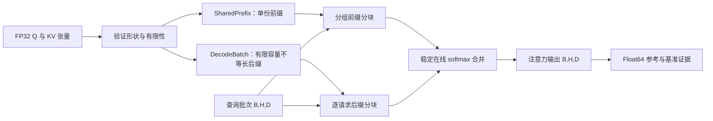
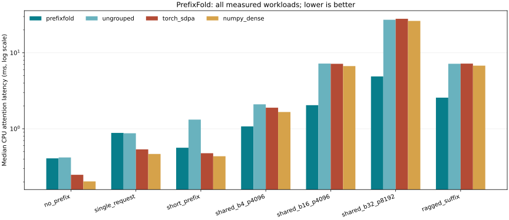

# 共享前缀注意力 · Shared-Prefix Attention

仓库原名 `prefixfold`；包名及现有命令保持不变（`prefixfold`）。

**CPU 上的共享前缀精确解码注意力。** 一个紧凑的数值计算库，在请求间共享长 KV 前缀、合并矩阵乘法，并稳定合并分块 softmax 状态。

[GitHub](https://github.com/hardwork-xu/shared-prefix-attention) · [English](README.md) · [研究说明](docs/zh/RESEARCH.md) · [API](docs/zh/API.md) · [实验](docs/zh/EXPERIMENTS.md)

[](https://github.com/hardwork-xu/shared-prefix-attention/actions/workflows/ci.yml)
[](LICENSE)
[](pyproject.toml)

我希望通过 PrefixFold 把一个推理瓶颈讲清楚：独立解码请求经常共享长提示词，但常规连续 KV 批次会反复存储和读取相同前缀。我希望在一个项目中同时解释所有权、数值正确性和性能证据。

目标使用者是研究 CPU 注意力、共享文档上下文和数值系统的工程师。本项目是**注意力算子**，接受符合约束的有限 FP32 张量与不等长后缀，不是文本生成服务或完整模型运行时。

## 本项目实现了什么

- 使用 NumPy/BLAS 的真实分组前缀路径、稳定分块 softmax 累加及对应后缀路径；`grouped=False` 仅关闭跨请求前缀分组。
- 自持有、不可变的前缀张量；固定容量不等长后缀；验证后原子追加、同步读取及显式资源释放。
- 可配置临时数组规划、独立 float64 参考、离线测试、实际 PyTorch CPU SDPA 基线，以及包含退化场景的源码关联原始实验。

分解与查询分组来自已有 **Cascade Attention / Hydragen**，不宣称原创算法。NumPy 提供数组与 BLAS，本仓库实现所有权、执行分区、状态累加与评测。详见[归属说明](NOTICE.md)及[核验来源](research/sources.json)。不宣称 SOTA。



对于分数 $x_j=q^T k_j/\sqrt D$，每个分区记录 $m=\max x_j$、$l=\sum_j e^{x_j-m}$、$z=\sum_j e^{x_j-m}v_j$。合并时将两个状态缩放至较大最大值，再相加 `l` 与 `z`，最终输出 `z/l`。不近似注意力权重；FP32 舍入误差以 `atol=rtol=3e-5` 对比 FP64 验证。

批量 `B`、头数 `H`、前缀长度 `P`、预留后缀容量 `C`、维度 `D` 下，FP32 K/V 存储为 `8 H D (P + B C)` 字节，复制前缀的缓存则为 `8 B H D (P + C)`。这是数组占用公式，**不是进程 RSS**。计算量仍与全部查询和键的交互成正比；分组改善数据复用和 BLAS 利用率。

## 安装与运行

声明支持 Python **3.11–3.13**。实测宿主机为 **macOS arm64、Python 3.12.2、M1 Pro、16 GiB**。实现仅使用 CPU；Metal/MPS 在环境中可用不代表本项目实现了 GPU 后端。已提供 Linux CPU CI 和容器配置，实际验证状态见[发布说明](docs/zh/RELEASE.md)。

在仓库根目录执行：

```sh
python3 -m venv .venv
.venv/bin/python -m pip install uv==0.8.22
.venv/bin/uv sync --frozen --group bench
make demo
.venv/bin/python examples/decode.py
make test check
make benchmark analyze
make build
```

默认示例离线运行，输出数值对比、真实数组分配量和后缀长度，无需模型下载、密钥或私人数据。运行时只依赖 NumPy，开发与基准依赖是独立锁定分组。仅安装运行时可用 `.venv/bin/uv sync --frozen --no-dev`。

```python
import numpy as np
from prefixfold import SharedPrefix, DecodeBatch, attend

rng = np.random.default_rng(42)
prefix = SharedPrefix(
    rng.standard_normal((2, 1024, 32), dtype=np.float32),
    rng.standard_normal((2, 1024, 32), dtype=np.float32),
)
with DecodeBatch(prefix, batch_size=4, capacity=8) as batch:
    batch.append(
        rng.standard_normal((4, 2, 32), dtype=np.float32),
        rng.standard_normal((4, 2, 32), dtype=np.float32),
    )
    output = attend(rng.standard_normal((4, 2, 32), dtype=np.float32), batch)
    print(output.shape)  # (4, 2, 32)
```

已有张量可通过 `prefixfold attend input.npz output.npz --tile-tokens 1024` 调用相同引擎。[API 文档](docs/zh/API.md)定义了键名、形状、错误与所有权。输入输出文件必须不同，已有输出不会被覆盖。

## 基准实测结果

**算子实测、合成 FP32 张量、仅 CPU。** NumPy 2.2.6、PyTorch 2.8.0，两者均请求单线程。`threadpoolctl` 无法观测 Apple Accelerate 的线程限制是否被严格执行，这是测量限制。每种实现、每个场景有 5 次预热与 30 次观测，独立工作进程以固定种子的随机顺序交错执行。构建和物化开销单独报告，不属于模型端到端延迟。

| 主指标，B=16 H=4 P=4096 S=128 D=64 | 计时前冻结的目标 | 实测 |
|---|---:|---:|
| 相对连续稠密缓存的 K/V 数组占用减少 | ≥80% | 90.91%（132 → 12 MiB） |
| 相对 PyTorch CPU SDPA 的计算中位数加速 | ≥1.25× | 3.50×（7.160 → 2.044 ms） |
| 对比 FP64 的正确性 | atol=rtol=3e-5，全部场景 | 28 个场景/实现组合全部通过 |

数值来自原始实验；[冻结目标](research/targets.json)未更改。默认实现在无前缀、单请求与短前缀场景比 SDPA 慢，应依据实测适用边界选择，不能笼统声称加速。

<!-- BENCHMARK:START -->

| 工作负载 | 实现 | 中位数 ms | SDPA / 当前实现 | KV MiB | KV 减少比例 | 最大绝对误差 | n |
|---|---|---:|---:|---:|---:|---:|---:|
| no_prefix | numpy_dense | 0.2029 | 1.222× | 4.000 | 0.00% | 2.30e-07 | 30 |
| no_prefix | torch_sdpa | 0.2480 | 1.000× | 4.000 | 0.00% | 2.13e-07 | 30 |
| no_prefix | prefixfold | 0.4081 | 0.608× | 4.000 | 0.00% | 2.09e-07 | 30 |
| no_prefix | ungrouped | 0.4193 | 0.591× | 4.000 | 0.00% | 2.09e-07 | 30 |
| single_request | torch_sdpa | 0.5357 | 1.000× | 8.250 | 0.00% | 3.14e-08 | 30 |
| single_request | ungrouped | 0.8724 | 0.614× | 8.250 | 0.00% | 2.84e-08 | 30 |
| single_request | prefixfold | 0.8819 | 0.607× | 8.250 | 0.00% | 2.84e-08 | 30 |
| single_request | numpy_dense | 0.4663 | 1.149× | 8.250 | 0.00% | 2.54e-08 | 30 |
| short_prefix | torch_sdpa | 0.4766 | 1.000× | 8.000 | 0.00% | 2.77e-07 | 30 |
| short_prefix | prefixfold | 0.5631 | 0.846× | 4.250 | 46.88% | 1.82e-07 | 30 |
| short_prefix | ungrouped | 1.3192 | 0.361× | 4.250 | 46.88% | 1.64e-07 | 30 |
| short_prefix | numpy_dense | 0.4352 | 1.095× | 8.000 | 0.00% | 2.70e-07 | 30 |
| shared_b4_p4096 | ungrouped | 2.0978 | 0.903× | 9.000 | 72.73% | 3.52e-08 | 30 |
| shared_b4_p4096 | torch_sdpa | 1.8942 | 1.000× | 33.000 | 0.00% | 3.71e-08 | 30 |
| shared_b4_p4096 | prefixfold | 1.0748 | 1.762× | 9.000 | 72.73% | 6.77e-08 | 30 |
| shared_b4_p4096 | numpy_dense | 1.6612 | 1.140× | 33.000 | 0.00% | 2.84e-08 | 30 |
| shared_b16_p4096 | numpy_dense | 6.6804 | 1.072× | 132.000 | 0.00% | 4.14e-08 | 30 |
| shared_b16_p4096 | torch_sdpa | 7.1603 | 1.000× | 132.000 | 0.00% | 4.16e-08 | 30 |
| shared_b16_p4096 | ungrouped | 7.2138 | 0.993× | 12.000 | 90.91% | 3.79e-08 | 30 |
| shared_b16_p4096 | prefixfold | 2.0437 | 3.504× | 12.000 | 90.91% | 1.01e-07 | 30 |
| shared_b32_p8192 | prefixfold | 4.8808 | 5.739× | 24.000 | 95.38% | 5.66e-08 | 30 |
| shared_b32_p8192 | ungrouped | 27.1801 | 1.031× | 24.000 | 95.38% | 2.42e-08 | 30 |
| shared_b32_p8192 | torch_sdpa | 28.0105 | 1.000× | 520.000 | 0.00% | 2.52e-08 | 30 |
| shared_b32_p8192 | numpy_dense | 26.2760 | 1.066× | 520.000 | 0.00% | 3.14e-08 | 30 |
| ragged_suffix | prefixfold | 2.5668 | 2.805× | 16.000 | 88.21% | 1.13e-07 | 30 |
| ragged_suffix | torch_sdpa | 7.1991 | 1.000× | 135.750 | 0.00% | 3.79e-08 | 30 |
| ragged_suffix | numpy_dense | 6.7725 | 1.063× | 135.750 | 0.00% | 3.92e-08 | 30 |
| ragged_suffix | ungrouped | 7.1642 | 1.005× | 16.000 | 88.21% | 4.34e-08 | 30 |

实测范围仅为 CPU 注意力计算；初始化单独记录。KV 字节是已分配数组的有效载荷，不是进程 RSS。原始 JSON 保留全部样本、首次调用、初始化和整个工作进程 RSS。吞吐按查询向量计数，不是生成 token。未声称极端尾延迟。

<!-- BENCHMARK:END -->



[840 个原始计时样本](results/benchmark.json) · [机器可读汇总](results/summary.json) · [完整协议与分块敏感性](docs/zh/EXPERIMENTS.md) · [本地验收记录](results/acceptance.json)

```sh
.venv/bin/python benchmark.py --config configs/benchmark.json --output results/reproduction.json
.venv/bin/python scripts/analyze.py --input results/reproduction.json --output-dir results/reproduction
```

分析脚本写入指定输出目录，只有显式传入 `--update-readme` 才更新 README 区域；`make analyze` 对主实验使用该参数。再次执行 `make benchmark` 前，请用不同文件名保留原始证据。原始 JSON 记录命令、构建、首次调用、完整样本、失败、数组占用、整个工作进程峰值 RSS、版本、种子、Git revision 和源码哈希。接近零输出的相对误差依据预设绝对/相对组合容差判断。30 次观测不足以声称 p99。

## 局限与维护

支持单层共享前缀、单 token 查询，以及相同的查询/KV 头数。调用者提供已经完成位置编码的 K/V，并保证前缀语义完全相同。不包含分词、prefill、GQA 头映射、前缀发现、淘汰池、训练、量化或生成采样。显式临时数组规划不包含返回输出、Python 与 BLAS 内部分配。有限输入导致 FP32 溢出时会报错。前缀对象不是按内容查找的缓存。

测试覆盖数值边界、不等长掩码、原子追加、并发状态一致性、清理、CLI 集成与基准格式，均可离线运行。`make validate` 执行安装、构建、命令、文档和隐私验收；缺少 Docker 时记录未执行。远端 CI 状态与本地测试分开记录。

| 文档 | 内容 |
|---|---|
| [研究](docs/zh/RESEARCH.md) | 假设、相关工作、数学与原创性边界 |
| [架构](docs/zh/ARCHITECTURE.md) / [API](docs/zh/API.md) | 所有权、接口、并发与资源口径 |
| [代码导读](docs/zh/WALKTHROUGH.md) | 从入口到内核的调用链与调试 |
| [实验](docs/zh/EXPERIMENTS.md) | 完整证据、基线、消融及不利场景 |
| [开发记录](docs/zh/DEVELOPMENT.md) | 实际修改、修复、验证与提交引用 |
| [发布](docs/zh/RELEASE.md) | 安装、说明草稿、公开元数据与状态 |
| [简历与项目讲解](docs/zh/RESUME.md) | 有证据支持的项目描述与讲解 |

我欢迎范围清楚、附带回归证据的贡献。请参阅[贡献指南](CONTRIBUTING_zh.md)、[安全与限制](SECURITY_zh.md)和[维护约定](AGENTS.md)。

## 许可证与引用

项目使用 [MIT 许可证](LICENSE)，依赖保留[归属说明](NOTICE.md)中的原有许可证。使用 [CITATION.cff](CITATION.cff) 引用软件版本和相关实验，并将已有算法归属原始研究。不宣称论文、DOI、生产部署或模型质量结果。
