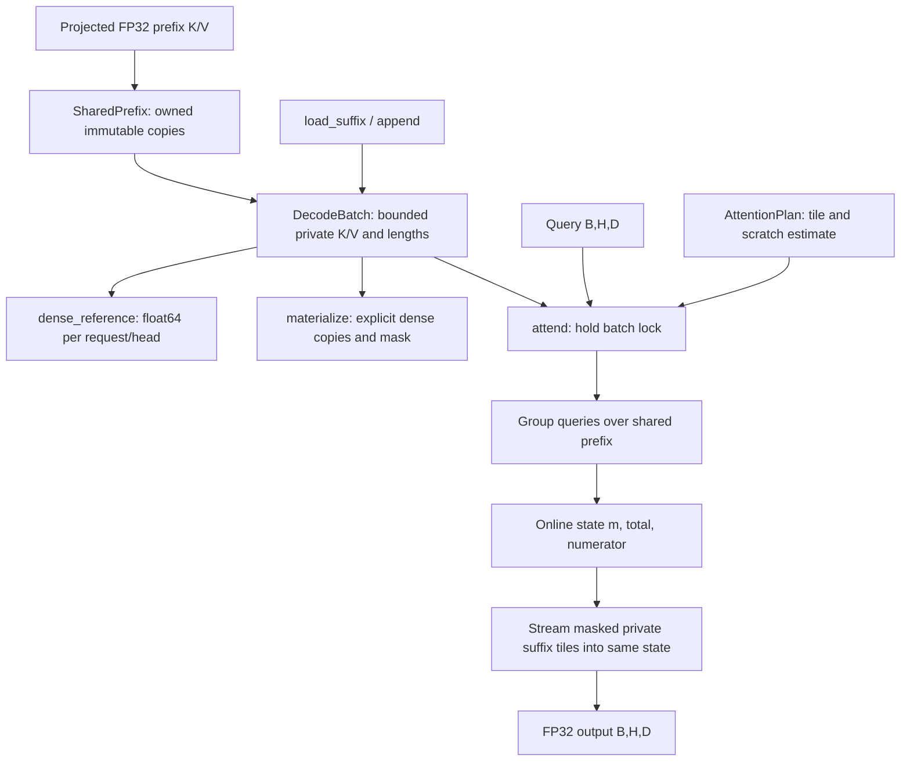

# Architecture

[简体中文](../zh/ARCHITECTURE.md) · [API](API.md) · [Code walkthrough](WALKTHROUGH.md)

PrefixFold has two core modules: [cache.py](../../src/prefixfold/cache.py) owns projected KV data and mutation rules; [attention.py](../../src/prefixfold/attention.py) reads a consistent cache state and performs the attention calculation. [__init__.py](../../src/prefixfold/__init__.py) exposes five public names. NumPy supplies arrays and matrix multiplication. PyTorch is an experimental baseline dependency, not the execution engine behind `attend`.

## Ownership and lifetime

`SharedPrefix(k, v)` accepts matching `(H,P,D)` float32 arrays and copies them into contiguous, read-only owned arrays. `H,D` must be positive; `P=0` is valid. Mutation of the constructor inputs cannot change later attention. The leading underscore fields are internal and must not be changed by callers.

Each `DecodeBatch` references one `SharedPrefix`. Several batches can reference the same object without another prefix copy. Prefix sharing is explicit object reuse: there is no token lookup, content hash, semantic matching, eviction policy, or tokenizer. The caller must establish that projected KV data and positional transforms are appropriate for every request.

A batch reserves two float32 arrays of shape `(B,H,C,D)` immediately, where `C` is suffix capacity, and an int64 length array `(B,)`. Unused capacity still occupies owned payload. `load_suffix` copies data into these buffers; `append` writes one new token for each selected request. Neither operation grows capacity. Capacity overflow is a failed operation, not implicit reallocation.

The `lengths` property returns a copy. `materialize` returns new dense K/V arrays with length `P + max(lengths)` and a separate validity mask. The prefix is physically duplicated by that debugging/baseline operation. Its returned arrays do not alias the cache.

`close()` drops this batch's reference to the prefix and replaces its buffers with empty arrays. It is idempotent. Another batch or caller can still retain the same prefix. The context manager closes on both normal exit and an exception. Releasing Python array ownership does not promise an immediate drop in operating-system RSS or secure erasure of memory.

## Consistency and errors

Every data mutation validates its array types, finite values, shapes, lengths or indices, and capacity before writing. An invalid load or append leaves the previous public state unchanged. Duplicate append indices are rejected because two writes to the same next position would be ambiguous. After a valid load, unused suffix slots are zeroed so extreme finite padding cannot overflow a later matrix product before masking.

Each batch owns an `RLock`. Cache reads, mutations, dense materialization, and the complete `attend` calculation hold that lock. An append cannot interleave with attention on the same batch. This favors a simple consistency contract over simultaneous reads of one batch. Independent batches have independent locks and can share an immutable prefix. This is not a scheduler, fairness guarantee, or process-safe shared-memory protocol.

The lock protects internal state, not the caller's query array. A caller must not mutate its query or source arrays concurrently with the operation using them. Invalid input raises `ValueError`; use after close raises `RuntimeError`; finite float32 values that overflow during arithmetic can raise `FloatingPointError`. Allocation failure may raise `MemoryError`. Exceptions propagate; the library does not silently return substitute output.

## Attention execution

Heads are processed sequentially. Within a head, grouped execution gathers the batch's query rows as one matrix view. Every shared-prefix tile is read by a matrix-matrix product. The private suffix uses batched products because its K/V differ by request. Length masking excludes invalid suffix positions. Both phases update the same `(m, total, numerator)` state; a separate full suffix-output buffer is unnecessary.

`_update` rescales the previous denominator and weighted numerator when the running maximum increases, then adds the new tile contribution. The implementation divides by the accumulated denominator only after all valid prefix and suffix positions have been consumed. This is the established attention-state reduction described in [Research](RESEARCH.md).

`grouped=False` changes only shared-prefix processing to one request at a time. The suffix uses the identical batched path in both modes. This isolates the effect of prefix query grouping, including its changed matrix shapes and Python loop overhead, while preserving the suffix implementation.

## Workspace and design tradeoffs

`AttentionPlan` selects a tile no larger than `tile_tokens` using the explicit-array estimate

$$W(B,D,T)=4B(4T+8D+32)\text{ bytes}.$$

For budget $W_{max}$, the implemented choice is

$$T_{effective}=\min\left(T_{requested},\left\lfloor\frac{\lfloor W_{max}/(4B)\rfloor-8D-32}{4}\right\rfloor\right).$$

If this cannot fit one token, execution is rejected. Defaults are 1,024 tokens and 8 MiB. Planning uses the full batch size even for the ungrouped variant. Sequential head processing is why the estimate has no multiplicative `H` term.

This is a conservative model of temporary arrays managed by the implementation, not measured process memory and not a process hard limit. It excludes input/cache storage, final output, vendor BLAS workspace, allocator behavior, and interpreter overhead. A large cache capacity can exceed available memory even with a small attention scratch budget.

Larger tiles reduce Python iterations and may improve BLAS efficiency, but increase temporary score storage. Smaller tiles make that storage more predictable, but can lose latency. NumPy keeps the implementation inspectable; a compiled fused CPU kernel would trade portability and maintenance cost for potentially lower temporary-array and dispatch overhead. Such a kernel is outside this release.
