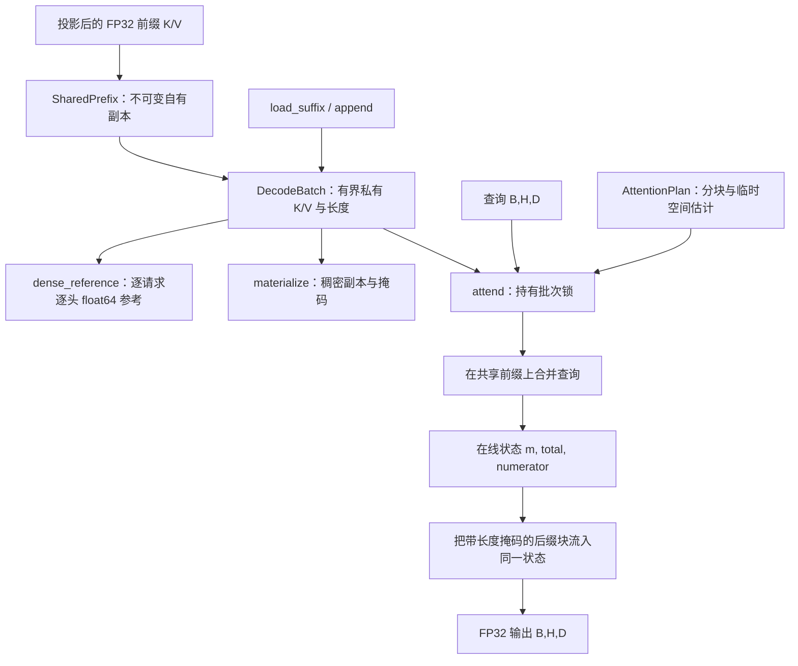

# 架构

[English](../en/ARCHITECTURE.md) · [API](API.md) · [代码导读](WALKTHROUGH.md)

PrefixFold 包含两个核心模块：[cache.py](../../src/prefixfold/cache.py) 负责投影后 KV 数据的所有权与变更规则；[attention.py](../../src/prefixfold/attention.py) 读取一致的缓存状态并计算注意力。[__init__.py](../../src/prefixfold/__init__.py) 导出五个公开名称。NumPy 提供数组与矩阵乘法；PyTorch 是实验基线依赖，不是 `attend` 内部的执行引擎。

## 所有权与生命周期

`SharedPrefix(k, v)` 接收形状一致的 `(H,P,D)` float32 数组，并复制为连续、只读、自有的数组。`H,D` 必须为正，允许 `P=0`。修改构造时的输入不会改变后续注意力结果。下划线开头的字段属于内部实现，调用者不得修改。

每个 `DecodeBatch` 引用一个 `SharedPrefix`。多个批次可以引用同一对象，无须再次复制前缀。共享由显式复用对象实现，不包含 Token 查找、内容哈希、语义匹配、淘汰策略或分词器。调用者必须保证投影后的 KV 数据与位置变换适用于每个请求。

批次立即预分配两个 `(B,H,C,D)` float32 数组，其中 `C` 是后缀容量，并分配 `(B,)` int64 长度数组。未使用的容量也占用已分配存储。`load_suffix` 把数据复制进缓冲区；`append` 为每个指定请求写入一个新 Token。两者均不会扩容；超过容量属于操作失败，不会隐式重新分配。

`lengths` 属性返回副本。`materialize` 返回长度为 `P + max(lengths)` 的新稠密 K/V 数组及独立有效位置掩码。这一调试/基线操作会物理复制前缀，返回数组不与缓存共享可变存储。

`close()` 释放当前批次对前缀的引用，并将缓冲区替换为空数组，可重复调用。其他批次或调用者仍可持有同一前缀。上下文管理器在正常退出或异常退出时均关闭批次。释放 Python 数组所有权不保证操作系统 RSS 立即下降，也不等于安全擦除内存。

## 一致性与异常

每次数据变更先验证数组类型、有限值、形状、长度或索引以及容量，再执行写入。非法加载或追加不会改变先前的公开状态。追加索引重复会被拒绝，因为同一个下一个位置的两次写入具有歧义。合法加载后会清零未使用后缀槽位，避免极大的有限填充值在后续矩阵乘法执行到掩码前就引发溢出。

每个批次持有一个 `RLock`。缓存读取、变更、稠密化以及完整的 `attend` 计算都持有该锁。同一批次的追加不能与注意力计算交错。这一设计优先提供简单的一致性契约，不允许同一批次的读取同时计算。不同批次有独立锁，可以共享不可变前缀；这不构成调度器、公平性保证或跨进程共享内存协议。

锁保护内部状态，不保护调用者的查询数组。调用者不得在操作读取查询或源数组时并发修改它们。非法输入抛出 `ValueError`；关闭后使用抛出 `RuntimeError`；有限 float32 数值在算术过程中溢出时可能抛出 `FloatingPointError`；分配失败可能抛出 `MemoryError`。异常向上传播，不会静默返回替代结果。

## 注意力执行

头按顺序处理。每个头内，分组执行将批次查询行作为一个矩阵视图；共享前缀的每一块通过矩阵乘法参与计算。私有后缀因每个请求的 K/V 不同，使用批量乘法。长度掩码排除无效后缀位置。两个阶段更新同一个 `(m, total, numerator)` 状态，不需要另存完整的后缀输出。

运行最大值上升时，`_update` 重新缩放已有分母与加权分子，再加上新块的贡献。只有在所有有效前缀和后缀位置处理完毕后，才用累计分母归一化。这是[研究文档](RESEARCH.md) 中说明的已有注意力状态归约方法。

`grouped=False` 仅把共享前缀处理改为逐请求执行，后缀在两种模式中使用相同的批处理路径。因此它在保持后缀实现一致的前提下，隔离前缀查询分组的影响，包括矩阵形状与 Python 循环开销的变化。

## 临时空间与设计取舍

`AttentionPlan` 根据显式数组估计选择不超过 `tile_tokens` 的分块：

$$W(B,D,T)=4B(4T+8D+32)\text{ 字节}.$$

预算为 $W_{max}$ 时，实现选取：

$$T_{effective}=\min\left(T_{requested},\left\lfloor\frac{\lfloor W_{max}/(4B)\rfloor-8D-32}{4}\right\rfloor\right).$$

不足以容纳一个 Token 时拒绝执行。默认值为 1,024 Token 与 8 MiB。即使关闭分组，规划仍使用完整批大小。由于逐头计算，估计式中没有乘以 `H`。

这是实现管理的临时数组的保守模型，不是实测进程内存，更不是进程内存硬限制。它不包括输入/缓存、最终输出、BLAS 厂商内部工作空间、分配器行为或解释器开销。即使注意力临时空间预算很小，较大的缓存容量仍可能耗尽可用内存。

较大块可减少 Python 迭代并可能提高 BLAS 效率，但会增加临时分数存储；较小块让这一存储更可控，却可能降低速度。NumPy 让实现便于检查；编译融合 CPU 内核可能减少临时数组和派发开销，但也增加可移植性与维护成本。本版本不包含该内核。
